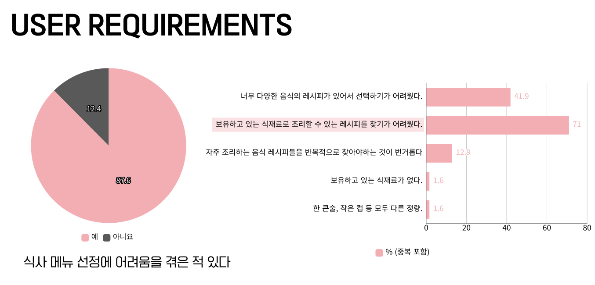
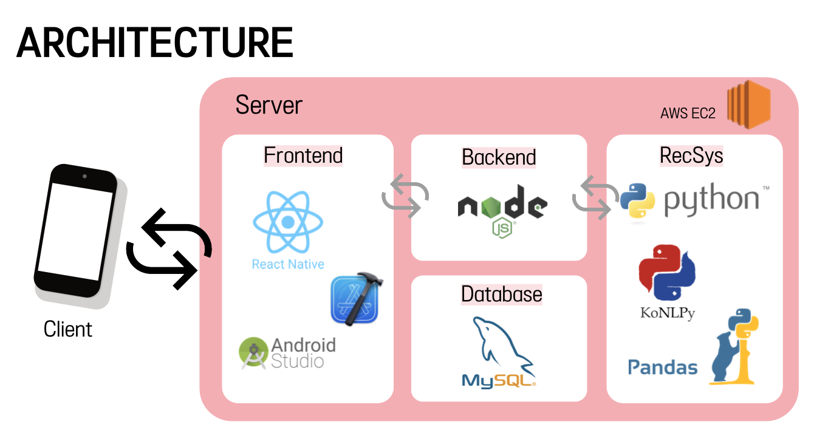
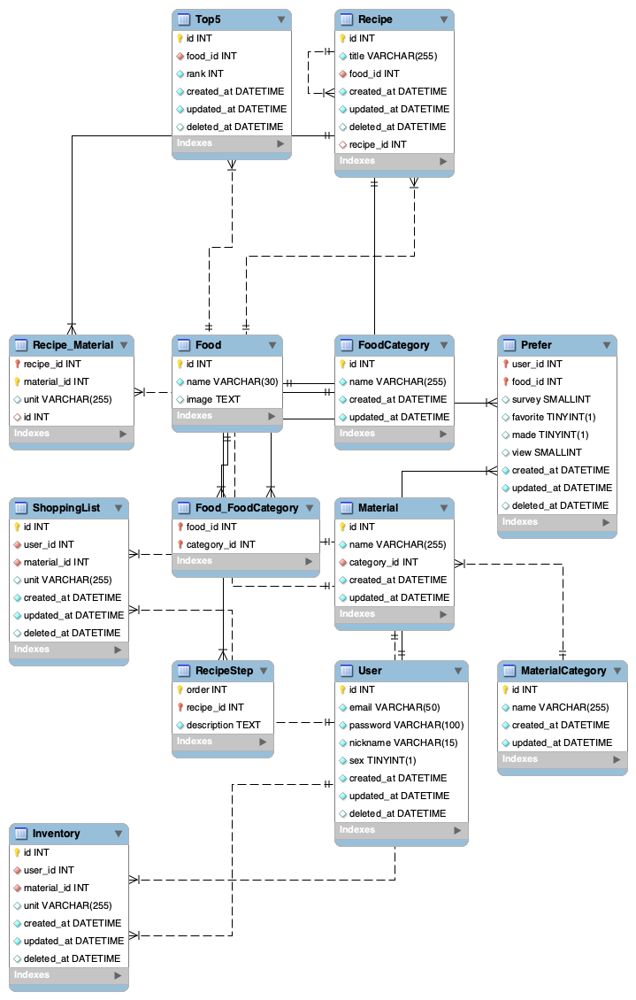
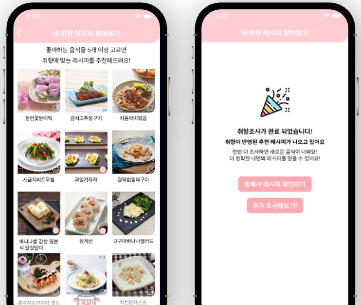
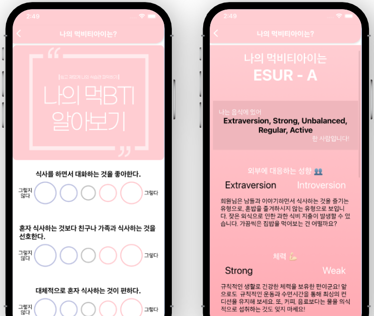
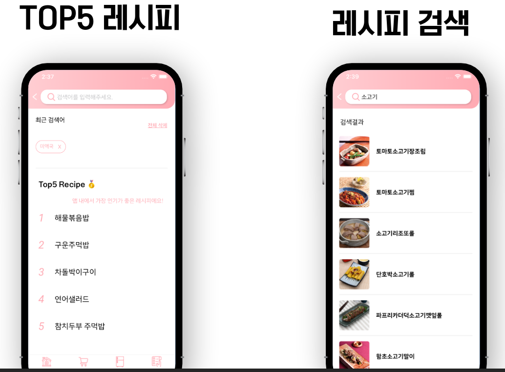
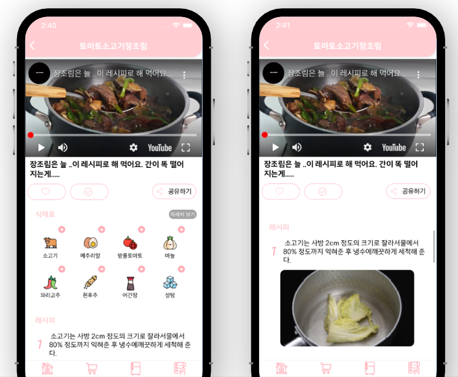
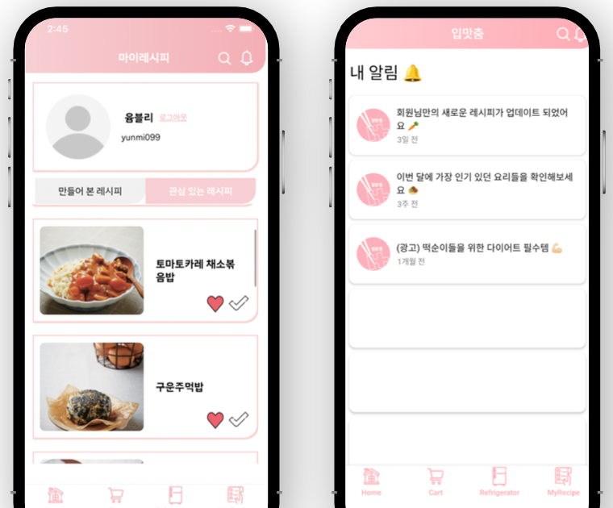

# Let Eat Go

> 추천 알고리즘 기반 레시피 추천 어플리케이션 🍽

## 프로젝트 소개 📝

현재 보유하고 있는 식자재를 기반으로 여러가지 **맞춤 레시피**를 확인할 수 있어요 !

본인의 취향에 맞는 여러가지 레시피 정보를 얻을 수 있어요 !

또한 **먹BTI 조사**를 통해 본인의 식습관과 영양 정보까지 얻을 수 있습니다 🥕

 

## 프로젝트 제작 동기 🔭

 

## 아키텍처 ⭐️

 

## ERD Diagram

 

## 프로젝트 기능 & 페이지 구성 📱

> 취향 맞춤 레시피 / 보유 식자재 기반 레시피 / 먹BTI

> 초기 선호도 조사

> 먹BTI 설문조사

> Top5 레시피 / 레시피 검색

> 레시피 상세 정보

> 나만의 냉장고 & 장바구니

> 마이 페이지 & 알림

